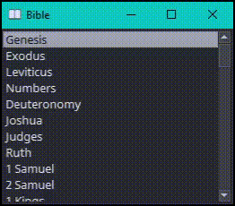

# Quick Bible

Fast and simple scripture finder. Use keyboard controls to navigate the Bible in a small desktop app.

__\*__  To fully benefit from the features of the New World Translation, such as references, footnotes, and study gems, visit the source at [jw.org](https://jw.org). Not affiliated.

Download the [latest release](https://github.com/wong-justin/quick-bible/releases/latest) for Windows.

## Controls

- Type to filter desired book, chapter, or verse
- `Enter` to select (nav forward), `Backspace` to nav back
- `Escape` to clear search

## Todo
- Search verses (ctrl-f)
  - search by regex
  - local search in book or chapter context?
- Resizable window
- Fix Psalms superscriptions and [other extras]
- Shortcut to books pane
- ctrl-c copy text
- ctrl-up/down navigate verses
- abbreviate books in window title?
- join all content into one json?

- make inital setup script run automatically [during installer setup?](https://nsis.sourceforge.io/Simple_tutorials)
- versioning: include in a "help" section for app? or just incl elsewhere, like in exe name or adjacent json
  - right click .exe -> Properties does show version and whatnot, so technically it's there just not as visible
  - auto updates? or user checking thru app at least?
    - app checks github page for new release maybe

steps to fbs-ify a pyqt app on windows

- install python 3.5 or 3.6 on system (necessary b/c fbs version limit)
  - [binary installers](https://www.python.org/downloads/release/python-368/) easier than building from source .tgz files
- create virtualenv with that python version: `virtualenv -p <path/to/python/36> ./env`
  - python maybe at `C:\Users\<user>\AppData\Local\Programs\Python\Python36`
`
- activate venv (`scripts/activate.bat`)
- `pip install` `fbs` and other packages (PyQt5, etc)
- follow fbs getting started [instructions](https://build-system.fman.io/manual/), like `fbs startproject`
  - restructure relative dirs to be in `src/main/resources`
  - refactor code referencing relative paths as `appctxt.get_resource([resources/]'path/to/file')`
  - replace main/app.py code final lines, mainly `appctxt.app.exec_()`
- `fbs run` to run app during testing (shortcut for `python src/main/python/[app].py`)
- `fbs freeze` to create `target/` installation dir
- `fbs installer` to make a setup wizard .exe after freeze; created next to `target/` dir

If errors on running packaged code, like `Failed to execute script main`, rebuild with `fbs freeze --debug` and it will log output on next run. Some of my errors:
  - doing minimal install of NSIS (windows installer creation); it needs all the components checked, eg. Modern GUI
  - trying my own directory structure, different from `src/main/resources/...` (`fbs freeze` doesn't recognize anything else)
  - not refactoring some relative paths into `appctxt.get_resource('rel/path')`

<!-- app name ideas: scripture snag??? -->
